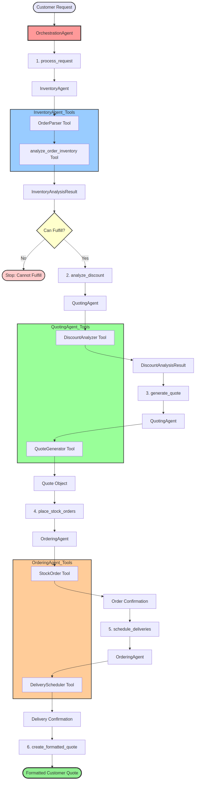

# Munder Difflin Multi-Agent System Workflow

## Overview

The Munder Difflin paper supply company uses a multi-agent system to process customer orders. The system consists of three specialized worker agents coordinated by an orchestration agent to handle inventory management, pricing, ordering, and quote generation through a 6-step workflow.

## Agent Architecture

### OrchestrationAgent

The central coordinator that manages the entire workflow from customer request to final quote. It delegates tasks to specialized agents through six coordinated tools:

- `process_request` - Delegates to InventoryAgent for parsing and inventory analysis
- `analyze_discount` - Delegates to QuotingAgent for discount analysis based on historical quotes
- `generate_quote` - Delegates to QuotingAgent to create the final quote
- `place_stock_orders` - Delegates to OrderingAgent to order stock from suppliers
- `schedule_deliveries` - Delegates to OrderingAgent to schedule customer deliveries
- `create_formatted_quote` - Formats the quote for customer presentation

### InventoryAgent

Responsible for parsing customer requests and analyzing inventory availability. This agent uses two key tools:

- `OrderParser` - Parses raw customer requests into structured `OrderRequest` objects with items, quantities, order date, and event details
- `analyze_order_inventory` - Analyzes each requested item to determine stock status, restock needs, and supplier delivery dates; returns `InventoryAnalysisResult`

### QuotingAgent

Handles discount analysis and quote generation. This agent utilizes two tools:

- `DiscountAnalyzer` - Analyzes order characteristics and historical quotes to determine applicable discounts; returns `DiscountAnalysisResult`
- `QuoteGenerator` - Generates complete quotes with item pricing, totals, discounts, and delivery dates; returns `Quote` object

### OrderingAgent

Manages stock replenishment and delivery scheduling. This agent uses two tools:

- `StockOrder` - Places stock orders with suppliers for items needing restocking; records transactions in database
- `DeliveryScheduler` - Schedules customer deliveries and records sales transactions in database

## Workflow Steps

### 1. Process Request (process_request tool)

The orchestration agent receives a customer request and delegates to the **InventoryAgent**:

- **InventoryAgent** uses `OrderParser` tool to parse the raw customer request text into a structured `OrderRequest` object containing:
  - List of `OrderItem` objects (item_name, requested_amount)
  - Event type (if applicable)
  - Order date (ISO format)
  - Latest delivery date (optional)
- **InventoryAgent** then uses `analyze_order_inventory` tool to check each item:
  - Verifies if item exists in inventory catalog
  - Retrieves current stock levels as of order date
  - Calculates restock needs based on requested amount and minimum stock levels
  - Determines supplier delivery dates for items needing restocking
- Returns `InventoryAnalysisResult` object containing:
  - Original `OrderRequest`
  - List of `ItemStockStatus` for each item (in_inventory, current_stock, restock_needed, supplier_delivery_date)
  - `can_fulfill_order` boolean flag
  - `earliest_delivery_date`

**Decision Point:** If `can_fulfill_order` is False, the workflow stops and returns a message indicating the order cannot be fulfilled.

### 2. Analyze Discount (analyze_discount tool)

The **QuotingAgent** analyzes the order for applicable discounts:

- **QuotingAgent** uses `DiscountAnalyzer` tool with the `InventoryAnalysisResult`
- Extracts keywords from order items and event type
- Searches historical quotes using `fetch_historical_quotes` to find similar past orders
- Analyzes order characteristics (size, event type, items)
- Determines appropriate discount percentage based on historical patterns
- Returns `DiscountAnalysisResult` object containing:
  - `need_size` - Order size classification (small/medium/large)
  - `discount_percentage` - Percentage discount to apply (0-100)
  - `discount_reason` - Explanation for the discount

### 3. Generate Quote (generate_quote tool)

The **QuotingAgent** creates the final quote:

- **QuotingAgent** uses `QuoteGenerator` tool with both `InventoryAnalysisResult` and `DiscountAnalysisResult`
- Retrieves unit prices for each item from inventory database
- Calculates individual item totals and overall subtotal
- Applies discount percentage to calculate final total amount
- Determines delivery date from inventory analysis
- Returns `Quote` object containing:
  - List of `QuoteItem` objects (item_name, requested_amount, unit_price, total_price)
  - `total_amount` (after discount)
  - `delivery_date`
  - `discount_applied` (dollar amount)
  - `discount_reason`
  - Optional `comments`

### 4. Place Stock Orders (place_stock_orders tool)

The **OrderingAgent** places orders with suppliers for items needing restocking:

- **OrderingAgent** uses `StockOrder` tool with the `InventoryAnalysisResult`
- For each item requiring restocking:
  - Calculates restock quantity and total cost (quantity × unit_price)
  - Creates 'stock_orders' transaction in database
  - Records item_name, quantity, price, and original order date
- Returns confirmation string listing all stock orders placed

### 5. Schedule Deliveries (schedule_deliveries tool)

The **OrderingAgent** schedules customer deliveries:

- **OrderingAgent** uses `DeliveryScheduler` tool with the generated `Quote`
- For each quote item:
  - Creates 'sales' transaction in database
  - Records item_name, quantity, total_price, and delivery date
  - Confirms delivery scheduling
- Supplier delivery lead times (automatically calculated by system):
  - ≤10 units: same day
  - 11-100 units: 1 day
  - 101-1000 units: 4 days
  - >1000 units: 7 days
- Returns confirmation string listing all scheduled deliveries

### 6. Create Formatted Quote (create_formatted_quote tool)

The orchestration agent formats the final customer-facing quote:

- Takes the `Quote` object and formats it as a readable string
- Includes:
  - Individual item breakdowns with quantities and prices
  - Subtotal before discount
  - Total amount with discount applied
  - Discount details (amount and reason)
  - Estimated delivery date
  - Any additional comments
- Returns formatted quote string as final output to customer

## Data Flow

1. **Customer Request** → OrchestrationAgent receives raw text request
2. **Request Parsing** → InventoryAgent parses request into structured `OrderRequest` with items and quantities
3. **Inventory Analysis** → InventoryAgent analyzes stock levels, restock needs, and supplier delivery dates
4. **Fulfillment Check** → System determines if order can be fulfilled; stops if not possible
5. **Discount Analysis** → QuotingAgent searches historical quotes and determines applicable discounts
6. **Quote Generation** → QuotingAgent calculates pricing, applies discounts, and creates `Quote` object
7. **Stock Ordering** → OrderingAgent places supplier orders for items needing restocking
8. **Delivery Scheduling** → OrderingAgent schedules customer deliveries and records sales transactions
9. **Quote Formatting** → OrchestrationAgent formats quote for customer presentation
10. **Customer Quote** → Final formatted quote delivered to customer with all details

## Data Models

### OrderRequest
- `items`: List of OrderItem (item_name, requested_amount)
- `event`: Optional event type
- `order_date`: ISO format date string
- `latest_delivery_date`: Optional ISO format date string

### ItemStockStatus
- `item_name`: Name of the item
- `in_inventory`: Boolean indicating catalog availability
- `current_stock`: Current stock level (if in inventory)
- `restock_needed`: Amount to restock (if any)
- `supplier_delivery_date`: Expected supplier delivery date (if restocking)

### InventoryAnalysisResult
- `order_request`: Original OrderRequest
- `item_stocks`: List of ItemStockStatus for each item
- `can_fulfill_order`: Boolean indicating if order is possible
- `earliest_delivery_date`: Earliest possible delivery to customer

### DiscountAnalysisResult
- `need_size`: Order size classification
- `discount_percentage`: Percentage discount (0-100)
- `discount_reason`: Explanation for discount

### Quote
- `quote_items`: List of QuoteItem (item_name, requested_amount, unit_price, total_price)
- `total_amount`: Final total after discount
- `delivery_date`: Estimated delivery date
- `discount_applied`: Dollar amount of discount
- `discount_reason`: Explanation for discount
- `comments`: Optional additional notes

## Database Integration

The system maintains transactional integrity through the SQLite database:

- **transactions** table - Records all stock orders and sales with dates and amounts
- **inventory** table - Maintains item catalog with unit prices and minimum stock levels
- **quotes** table - Stores historical quotes for pricing analysis
- **quote_requests** table - Archives customer inquiries

All inventory calculations are date-aware, allowing the system to compute stock levels as of any specific date by summing stock orders and subtracting sales transactions.
